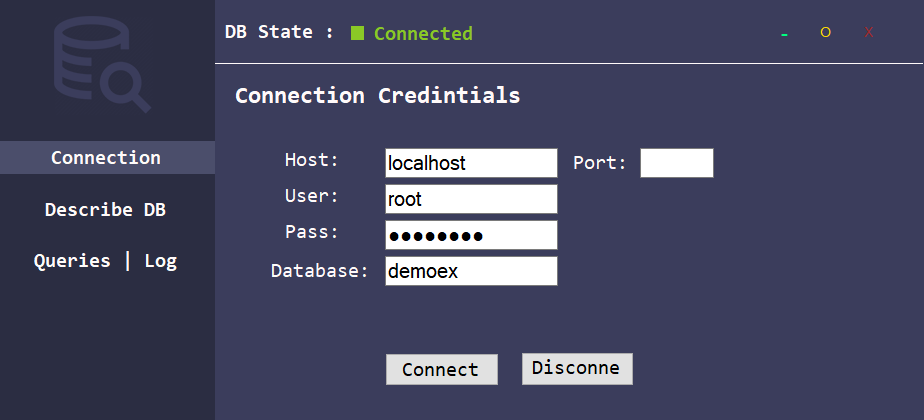
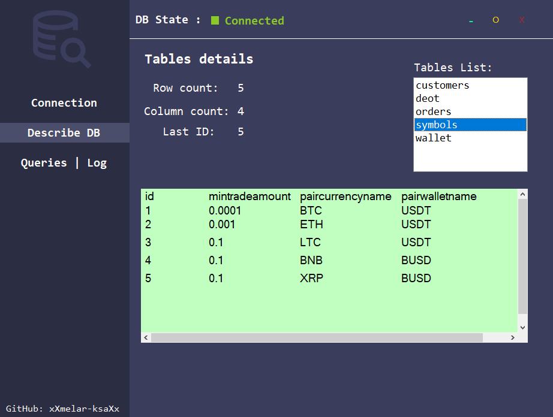
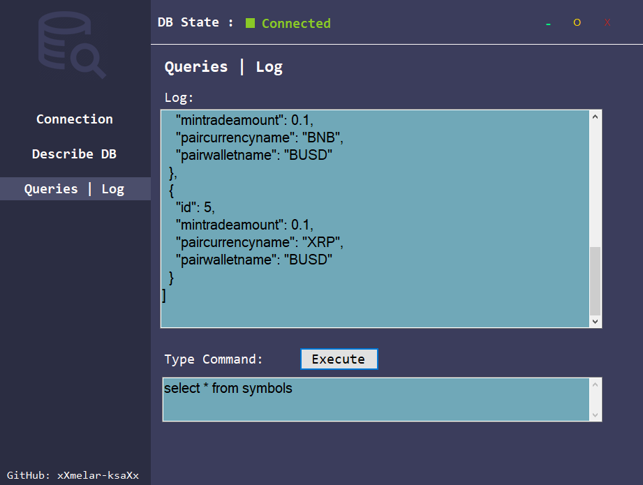

# DB-Viewer

### Connect to MySql database, describe tables and execute sql commands.

DB-Viewer is a desktop application for windows OS. Developed in C# using Windows Forms.

Download installer : [DB-Viewer](https://github.com/xxmelar-ksaxx/DB-Viewer/raw/master/Installer/DB%20Viewer.zip)

## Connection
- You may skip the port field.
- Database field => Database Name.

  

## View tables info
 - List of all tables in your Database will apper.
 - Selecting a table name will describe it in the table-box below.
 
 

  

## Make Queries 
- Send sql commands

  

